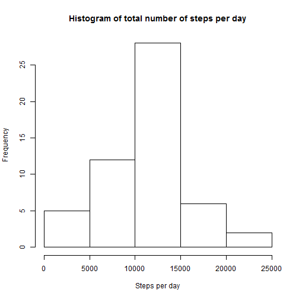
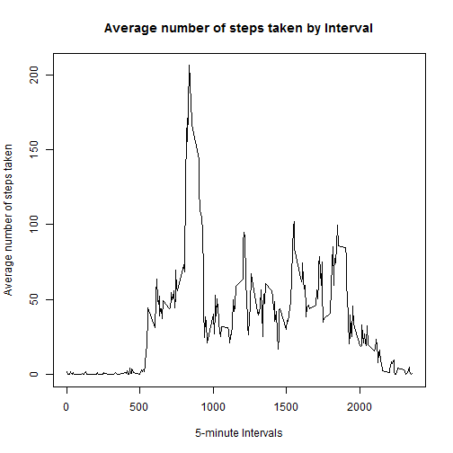
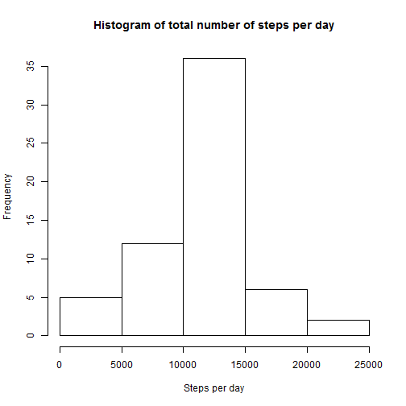
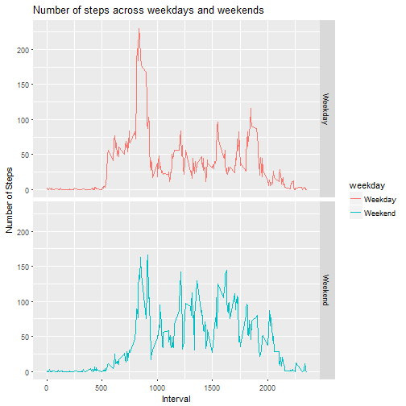

# Reproducible Research: Peer Assessment 1

## Loading and preprocessing the data

1. Read the csv file
2. Remove all missing values


```r
# Load the data file into a data frame
activity <- read.csv("./data/activity.csv", as.is = TRUE)

# Remove the NA values and store in a separate structure for future use
activityClean <- activity[complete.cases(activity), ]
```

## Histogram of total number of steps taken each day

1. Calculate total number of steps taken by date
2. Plot a histogram of the same


```r
# Calculate the total number of steps taken per day
stepsByDate <- aggregate(steps ~ date, activityClean, sum)

# Plot a histogram of total number of steps taken per day
hist(stepsByDate$steps, main = "Histogram of total number of steps per day", xlab = "Steps per day")
```



## Mean and median number of steps taken each day

1. Mean

```r
mean(stepsByDate$steps)
```

```
## [1] 10766.19
```
2. Median

```r
median(stepsByDate$steps)
```

```
## [1] 10765
```

## How does the average number of steps taken vary over time?


```r
# Calculate average number of steps taken by 5-minute intervals
stepsByInterval <- aggregate(steps ~ interval, activityClean, mean)

# Plot the time series with appropriate labels and heading
plot(stepsByInterval$interval, stepsByInterval$steps, type='l', main="Average number of steps taken by Interval", xlab="5-minute Intervals", ylab="Average number of steps taken")
```



```r
maxInterval <- which.max(stepsByInterval$steps)
```

The 5-minute interval, on average across all the days in the dataset, that contains the maximum number of steps is 835.

##. Strategy for imputing missing data
Missing data is imputed using average for that 5-minute interval across all days.


```r
activityImputed <- activity
for (i in 1:nrow(activityImputed)) {
    if(is.na(activityImputed$steps[i])) {
        avgSteps <- stepsByInterval$steps[which(stepsByInterval$interval == activityImputed$interval[i])]
        activityImputed$steps[i] <- avgSteps 
    }
}
```

## Histogram of the total number of steps taken each day after missing values are imputed

```r
# Calculate the total number of steps taken per day
stepsByDateImputed <- aggregate(steps ~ date, activityImputed, sum)

# Plot a histogram of total number of steps taken per day (imputed values)
hist(stepsByDateImputed$steps, main = "Histogram of total number of steps per day", xlab = "Steps per day")
```



## Mean and median number of steps taken each day after imputation
1. Mean

```r
mean(stepsByDateImputed$steps)
```

```
## [1] 10766.19
```
2. Median

```r
median(stepsByDateImputed$steps)
```

```
## [1] 10766.19
```

## Are there differences in activity patterns between weekdays and weekends?

Comparison of the average number of steps taken per 5-minute interval across weekdays and weekends

```r
#
weekends <- c("Saturday","Sunday")
activityImputed$weekday <- as.factor(ifelse(is.element(weekdays(as.Date(activityImputed$date)),weekends), "Weekend", "Weekday"))

stepsByInterval_w <- aggregate(steps ~ interval + weekday, activityImputed, mean)
library(ggplot2)
ggplot(stepsByInterval_w, aes(y=steps, x=interval)) + geom_line(aes(color=weekday,group=weekday)) + facet_grid(weekday ~ .) + labs(x = "Interval", y = "Number of Steps", title = "Number of steps across weekdays and weekends")
```



From this plot, we can observe that activity start time is generally later on weekends and less intense in the weekend mornings.
